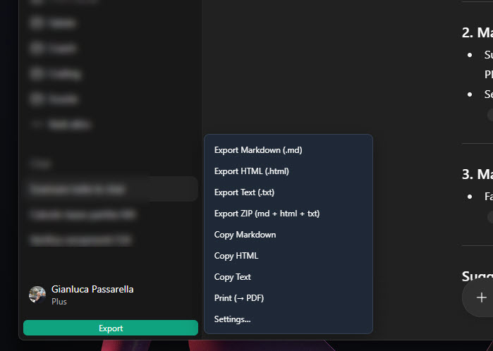
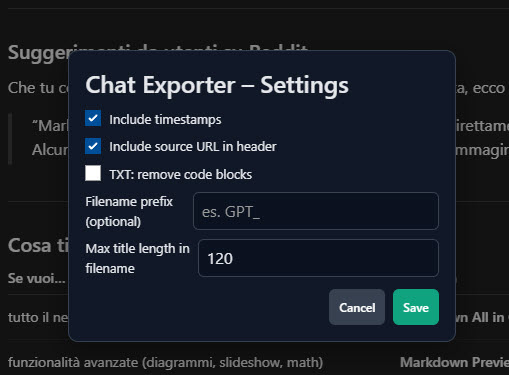
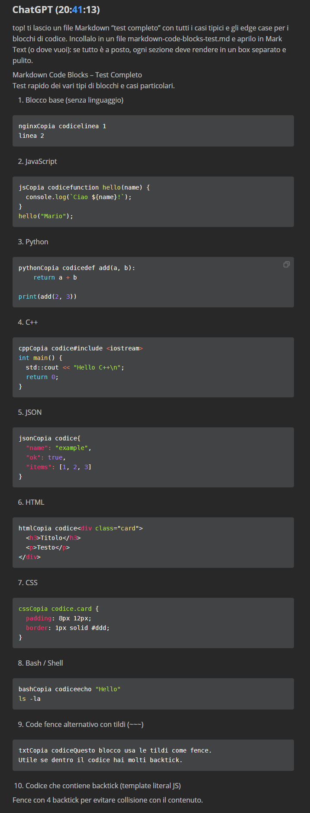

# ChatGPT Chat Exporter – Pro (MD/HTML/TXT/ZIP, Copy, Print, Settings)

Esporta le conversazioni da ChatGPT/ChatGPT.com in **Markdown**, **HTML**, **TXT**, oppure in un unico **ZIP** (md+html+txt).  
Include **Copy to clipboard**, **Print via iframe (→ PDF)**, **Settings** (timestamp, source URL, TXT senza code block), **filename robusto** con titolo conversazione + data, e un menu **flottante** “Export”.

> ✨ Zero dipendenze, nessuna chiamata di rete, nessun auto-update. Tutto gira *client-side* nel browser.

## ✨ Funzionalità
- **Export singolo**: Markdown (`.md`), HTML (`.html`), Text (`.txt`)
- **Export combinato**: ZIP (`.zip`) con md + html + txt (compatibile, no-compression *store*)
- **Copy**: copia MD/HTML/TXT negli appunti
- **Print → PDF**: stampa l’HTML via `iframe` (no popup blocker)
- **Settings**: 
  - Include timestamps
  - Include source URL in header
  - TXT: rimuovi completamente i `code block`
  - Filename prefix & max title length
- **Titolo filename robusto**: data + titolo conversazione (fallback intelligenti)
- **Menu compatto** (un solo bottone “Export” in sidebar / fixed se la sidebar non c’è)
- **Markdown a prova di viewer**: code fence dinamici (backtick auto), righe vuote attorno ai blocchi, token safe

## 🔒 Sicurezza & privacy
- Nessun invio dati in rete.
- Nessuna libreria esterna.
- Export e ZIP sono generati localmente in memoria e scaricati via `URL.createObjectURL`.

## 🧩 Requisiti
- **Browser** con estensione **Tampermonkey** (o compatibile userscript manager).
- Siti supportati:
  - `https://chat.openai.com/*`
  - `https://chatgpt.com/*`

## 🛠️ Installazione
1. Installa **Tampermonkey** (Chrome/Edge/Firefox).
2. Scarica il file [`userscripts/chatgpt-chat-exporter-pro.user.js`](userscripts/chatgpt-chat-exporter-pro.user.js).
3. Apri Tampermonkey → **Dashboard** → **+ Create a new script** → incolla il contenuto → **Save**.

> Volendo: **File → Import** in Tampermonkey e seleziona il file `.user.js`.

## ▶️ Utilizzo
- Apri una chat su ChatGPT.
- Clicca il bottone **Export** (in sidebar o in basso a destra).
- Scegli l’azione: *Export Markdown*, *Export HTML*, *Export Text*, *Export ZIP*, *Copy*, *Print*, *Settings*.

## ⚙️ Settings
- **Include timestamps**: aggiunge l’orario accanto a ogni “You/ChatGPT”.
- **Include source URL**: inserisce in header l’URL della pagina.
- **TXT: remove code blocks**: se ON, nel `.txt` rimuove del tutto i blocchi di codice (utile per lettura “solo testo”).
- **Filename prefix / Max title length**: personalizza il nome file.

## 🧪 Note sul Markdown
- I blocchi `<pre><code>` vengono trasformati in fenced code MD con **numero dinamico di backtick**, così anche se il codice contiene \` o ``` non si rompe il box.
- Righe vuote **sempre** sopra e sotto i blocchi → compatibilità con viewer come **Mark Text**, VS Code, Obsidian, GitHub.

## 🖼️ Screenshot

- Menu: 
- Settings: 
- Output: 
  
  
## 🐞 Troubleshooting
- **ZIP non scarica** → alcuni browser bloccano click immediati: qui usiamo un piccolo delay; se ancora nulla, verifica Console (F12) per messaggi `[Exporter]`.
- **Code block “fuori dal box” nel .md** → aggiornato: ora i fence sono robusti. Se trovi edge case, apri una Issue con un file di esempio.
- **Bottone Export non visibile** → il DOM di ChatGPT cambia spesso: il bottone viene iniettato in sidebar o si posiziona “fixed” in basso a destra (z-index alto). Ricarica la pagina o aspetta 1–2 secondi.

## 🧑‍💻 Sviluppo
- Repo include `.editorconfig`, `.eslintrc.json`.  
- Stile: preferisci codice chiaro, zero dipendenze, no chiamate di rete.
- **Niente auto-update**: per policy privacy. Se vuoi un branch “auto-update”, crea una variante con `@downloadURL/@updateURL` puntando alla **raw URL** del file su GitHub (GreasyFork-style), *ma* è opzionale.

## 📦 Build / Release
relase 1.0.0.2

## 📄 Licenza
**MIT** – vedi `LICENSE`.

---
